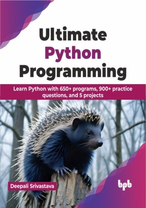

# Ultimate Python Programming

Dive deep into the core concepts of Python

This is the repository for [Ultimate Python Programming
](https://bpbonline.com/products/ultimate-python-programming?variant=43681935032520),published by BPB Publications.

## About the Book
This book provides a comprehensive and thorough introduction to Python, a popular programming language used by various top companies across various domains. Whether you are a novice starting your programming journey or an experienced programmer looking to expand your skill set, this book is designed to assist you in mastering core Python concepts.

Starting with the basics, this book guides you through the setup, basic commands, and key language rules. The book covers important ideas like different types of data, variables, and how to control the flow of your programs. You will also learn about collections for organizing data, functions for reusable code, modules for organizing bigger projects, and object-oriented programming for modeling real-world things. Advanced topics include customizing object behavior, efficient data processing, modifying function behavior, and handling errors gracefully.

The book includes many figures and coding examples to give you a visual and hands-on experience. There are numerous exercises that provide opportunities to further reinforce your knowledge. By the end of this book, readers will develop a strong foundation in core Python and will gain the confidence to excel in their studies and professional work.

## What You Will Learn
• Develop programs using procedural, object-oriented, and functional paradigms.

• Understand complex topics like iterators, generators, and decorators.

• Learn how to create and use modules and packages.

• Master the advanced concepts of object-oriented programming.

• Learn how to handle errors in Python and interact with files.

• Automate resource management patterns using context managers.
